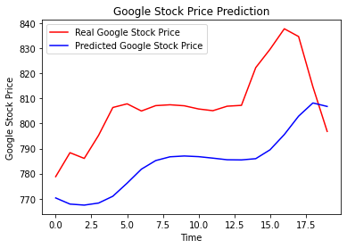
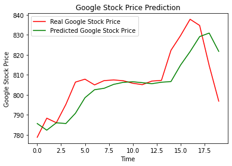
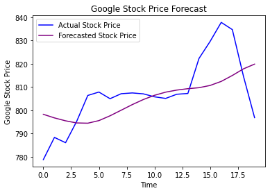

# Google stock trend prediction using Recurrent Neural Networks

Training a stacked LSTM model on 2012-2016 open Google stock price data to predict 2017 opening stock price using Recurrent Neural Network stacked LSTM. 

The dataset is split into training data with Google stock price from the year 2012-2016 and testing data with stock price in 2017. The training data consists of 13,000 data points - there are six variables, i.e., the date which is essentially dates from January 2012 through December of 2016, the opening stock price on a financial day, the highs and lows, the closing stock price value and the volume of the stock trading. The testset contains the opening price for the quarter of 2017 in order to verify the LSTM model.

The test model was based on five year data but greater the data size more precisely the model could be trained. Therefore, the future goal is to perform training with the past ten years of data from UCI Machine Learning Repository. Increasing the number of time steps is also an exploration. This model remembered the stock prices from the 60 previous financial days, as I chose 60 timesteps, in order to predict the stock price of the next day. I would also explore how would this react if that number of time steps were increased (or decreased). The goal is to double it, so 120 time steps of 6 months rather than 3 months for this study's model. Adding more LSTM layers is also on the table. This RNN was constructed with four LSTM layers, however more layers testing could be performed for analysis and tuning these setting more higher precision model. Finally, more neurons in the LSTM layers could also be probed. Understandably, a high number of neurons is required in the LSTM layers to better respond to the complexity of the problem, so I opted for including about fifty neurons in each of 4 LSTM layers. Nevertheless, it should not be limited to that. I aim to explore the architecture with more neurons in each of the four LSTM layers used here and tune that parameter to see the variations in the outcomes.

Check out the folders for code and results. 
